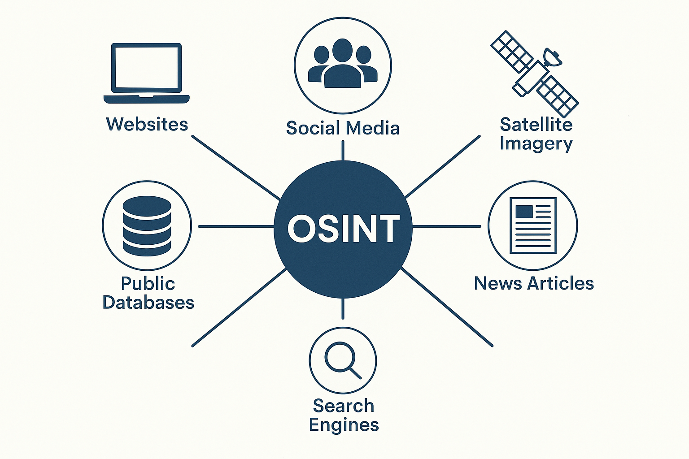

# 🔍 OSINT & E-Réputation : De l'Investigation à la Maîtrise de l'Empreinte

Bienvenue sur l'espace de ce cours dédié à l'Open Source Intelligence (OSINT) et à l'analyse de l'empreinte numérique. Ce dépôt centralise toutes les ressources, documents et liens nécessaires pour suivre les différents modules.

---

## 📍 Introduction au cours

Cette première section pose les bases du cours, avec une présentation des objectifs, du contexte de mise en situation et des ressources documentaires fondamentales.

* 🎥 **[Vidéo d'Introduction](https://www.youtube.com/watch?v=F6FFahP0Byg)**
* 📄 **[Accroche du cours (PDF)](./Introduction/Accroche-L_OSINT_l_e-réputation_et_les_moyens_de_protection_des_traces_numériques.pdf)**
* 📄 **[Prérequis et Scénarisation (PDF)](./Introduction/Prerequis_et_scenarisation.pdf)**
* 📚 **[Bibliographie (PDF)](./Introduction/Bibliographie_OSINT.pdf)**

---

## 🕵️‍♂️ Module 1 : Introduction à l'OSINT

### 📖 Cours
* 📄 **[Cours : Introduction à l'OSINT (PDF)](./Module_1/Cours_Module_1.pdf)**
* 🎥 **[Cours Vidéo](https://www.youtube.com/watch?v=mNspfZHjQuo)**

**Représentation de l'OSINT :**  

### 💼 Étude de cas
* 🔗 **[L'affaire SILK ROAD](https://www.youtube.com/watch?v=5jMP3RVm-kg)**

### 🛠️ Travaux Pratiques
* 📄 **[Sujet du TP 1 (PDF)](./Module_1/TP1_Initiation_OSINT_Google_Dorks_WHOIS.pdf)**

### 📝 Questionnaires à Choix Multiples
* 🔗 **[QCM - Module 1 : Introduction à l'OSINT](https://forms.office.com/e/dTMu8DrTAZ)**
* 🔗 **[QCM Avancé - Module 1 : Introduction à l'OSINT](https://forms.office.com/e/8p36HJNNT7)**

---